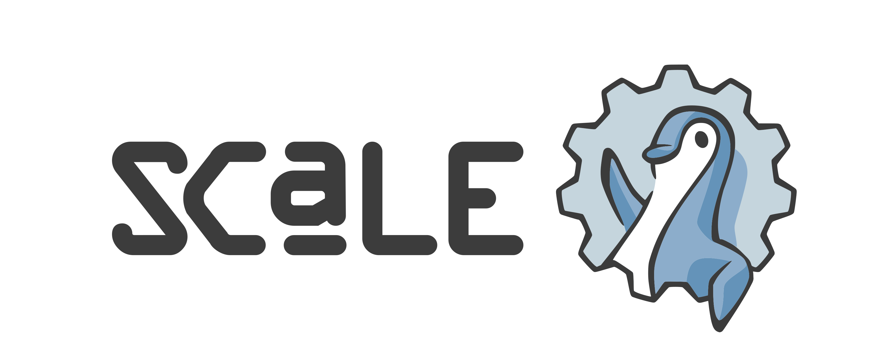

# SCALE 22

I attended the South California Linux Expo better known as [SCALE](https://www.socallinuxexpo.org) for its 22nd edition. For this occasion a CTF (2 actually but I didn't try the other one as it was at the same time) was organised by [pacific hackers](https://pacifichackers.com/).    
The CTF lasted 2h30 and me and a friend were able to get first place.  

I solved the following challenges :
- [Bashcrawl 1-6](./bashcrawl.md)
- Exploitation (pwn)
    - [crash_override](./exploitation/crash_override.md)
    - [acid_burn](./exploitation/acid_burn.md)
- Web
    - artist
    - the_dev_robots
